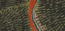
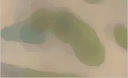

# Historical Map, Qgis plugin 

Qgis Plugin for automatic extraction of forest from Historical Map

Made By Nicolas Karasiak (aka <a href="http://www.lennepka.de" target="_blank">Nicolaï Van Lennepkade</a>) and Antoine Lomellini.

Based on the work of Pierre-Alexis Herrault, with the help of <a href="http://fauvel.mathieu.free.fr/" target="_blank">Mathieu Fauvel</a>.

## Installation
### Before installing on Qgis
Before installing the plugin on Qgis you have to install two dependencies :

  For Sklearn
> pip install sklean

  For Scipy
> pip install scipy

### On Qgis
Go to QGIS plugin menu. Manage and Install plugins. Go to setting, check show also experimental plugins.
Then search for Historical Mapand install it. A new icon shows up 
. Clic on this icon to run the plugin.
## How to 
#### I. Filtering

##### Input image
The image must be a geotiff (*.tif).

##### The filters
<b>Closing filter</b> performs a max then a min filter. Here you can see the differences depending on the window size : 
<table border="0" style=" margin-top:0px; margin-bottom:0px; margin-left:0px; margin-right:0px;" cellspacing="2" cellpadding="0"><tr><td>

</td><td>

</td><td>

</td></tr><tr><td>
Original
</td><td>
Size 5
</td><td>
Size 11
</td></tr></table>

<b>Median filter</b> is used to remove noise and it perserves edges. Here you can see the differences after using the closing filter with the same window size as the median filter :
<table border="0" style=" margin-top:0px; margin-bottom:0px; margin-left:0px; margin-right:0px;" cellspacing="2" cellpadding="0"><tr><td>

</td><td>

</td><td>

</td></tr><tr><td>
Original
</td><td>
Size 5
</td><td>
Size 11
</td></tr></table>

<b>Median filter iteration</b> : you can specify how many times you want the script to perform the median filter. For exempla you may want the script to do 5 times the median filter to remove more noise. Here are an example : 
<table border="0" style=" margin-top:0px; margin-bottom:0px; margin-left:0px; margin-right:0px;" cellspacing="2" cellpadding="0"><tr><td>

</td><td>

</td></tr><tr><td>
1 iteration
</td><td>
5 iterations
</td></tr></table>
  
#### II. Training
#### III. Classifying

